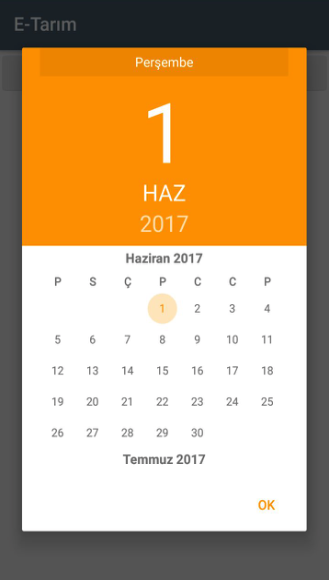

# e-Tarim 

## Project Scope

The project is about collecting and storing the data on a specific area through a drone with an embedded system connected to it. The collected data is transferred to a data collection point (a Raspberry Pi communication mediator) which sends. The data to own server using the MQTT protocol. The collected data are processed and display on the android with the help of a web service. Thanks to the Arduino and Wi-Fi module on the drone and sensors on the field, information was collected and transferred to the server via software. This information has been published with the web service, and this information is displayed on the Android side. The user evaluated this information and performed the production management accordingly. 

## UI Design

The application is designed as shown below as a user friendly and simple interface.

Login Screen           |  Register Screen
:-------------------------:|:-------------------------:
  |  

The initial screen starts with login. If the user is not registered on the system, 
the user is redirected to the register page as shown above.
Within this information, the user registers with the system. Then the user can easily enter the system.

  

As shown above, while user is registering, the map of areas 
and fields are listed in Google Map. So, users can select their
fields easily with clicking the markers. Each marker represents a field.

Wheel Values                     | Wheel Detail
:-------------------------:|:-------------------------:
  |  

As shown as above, the selected field and the sensor values of that field are shown in the wheel.
These values are instantaneous values. When click on any of the sensors in the wheel,
a screen appears with detailed information about the selected sensor, as shown on right side.
On this screen, two graphics are presented. The above graph is am time, and the graphic below is pm. 
Graphic content is a detailed representation of the value cycle of the selected sensor that changes at specific intervals.

Wheel Values                     | Wheel Detail
:-------------------------:|:-------------------------:
  |  

These two pages are designed so that the user can see the sensor values in the past. 
The user first selects the desired date by clicking on the 'Select Date' button as shown on left side 
and the sensor data for that item is displayed on the graph as shown on right side.
